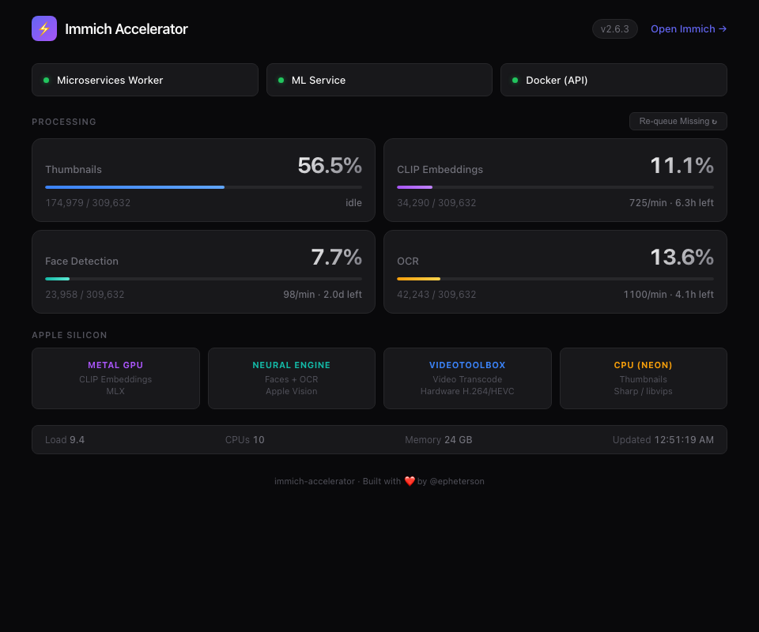

# Immich Accelerator

> **Alpha — use at your own risk.** Tested on Mac Mini M4 (24GB) with Immich v2.7.2 and OrbStack. Back up your Immich database before trying this.

Run Immich's compute natively on Apple Silicon. Thumbnails use the fast M-series CPU, video transcoding uses VideoToolbox hardware encoding, and ML runs on Metal GPU, Neural Engine, and CoreML.

Docker handles the lightweight parts (API server, Postgres, Redis). The accelerator runs Immich's own microservices worker natively on macOS, giving it access to hardware that Docker can't reach.

## How it works

```
Docker (lightweight)                 Native macOS (compute)
+-----------------------+           +-------------------------------+
|  immich-server (API)  |           |  Immich Accelerator           |
|  postgres             |<--------->|  +- Microservices worker      |
|  redis                |  DB+Redis |  |  +- Sharp (thumbnails)     |
|                       |           |  |  +- ffmpeg (VideoToolbox)  |
|  WORKERS_INCLUDE=api  |           |  +- ML service                |
|  ML_URL=host:3003     |           |     +- CLIP (MLX/Metal)       |
+-----------------------+           |     +- Faces (Vision/ANE)     |
                                    |     +- OCR (Vision/ANE)       |
                                    +-------------------------------+
```

The microservices worker is extracted directly from your running Immich Docker image. Always the exact same version, no source builds. The only modification is installing the macOS-native Sharp binary for image processing. Video transcoding is intercepted by a lightweight ffmpeg wrapper that remaps software encoders to VideoToolbox hardware encoders.

## What we modify (and how to undo it)

**Nothing inside Docker is modified.** We don't patch Immich, rebuild images, or replace containers. All changes are to your `docker-compose.yml` and can be reverted by removing a few lines.

| What we change | How | Reversible? | Risk |
|---------------|-----|-------------|------|
| Add env vars to docker-compose | `IMMICH_WORKERS_INCLUDE`, `IMMICH_MACHINE_LEARNING_URL`, `IMMICH_MEDIA_LOCATION` | Remove the lines | None |
| Expose Postgres/Redis ports | `5432:5432`, `6379:6379` in docker-compose | Remove the port lines | None |
| Native microservices worker | Extracted from Docker image, runs via `node` | Stop the accelerator | None |
| Native ML service | Separate Python service | Stop the accelerator | None |
| `/build` symlink (Immich 2.7+) | `/etc/synthetic.d/immich-accelerator` — requires sudo once during setup | `immich-accelerator uninstall` removes it; reboot to deactivate | Low |

**Why `/build`?** Immich 2.7+ stores absolute plugin paths like `/build/corePlugin/dist/plugin.wasm` in its database. Both Docker and native workers need `/build` to resolve. macOS SIP prevents creating root-level directories, so we use Apple's [synthetic link](https://man.cx/synthetic.conf(5)) mechanism to map `/build` → `~/.immich-accelerator/build-data`. Setup prompts for sudo once; a reboot may be required to activate.

**To fully revert:** Stop the accelerator, remove the env vars and port mappings from docker-compose, `docker compose up -d`. Immich is back to stock.

## Requirements

- macOS on Apple Silicon (M1/M2/M3/M4)
- Immich already running in Docker (on this Mac or a remote host like a NAS)
- [Homebrew](https://brew.sh) (setup will offer to install Node.js and libvips if missing)
- Python 3.11+ for the ML service

> **FFmpeg:** Downloaded automatically during setup ([jellyfin-ffmpeg](https://github.com/jellyfin/jellyfin-ffmpeg) — the same ffmpeg Immich uses in Docker).

## Quick start

### 1. Install and run setup

```bash
brew tap epheterson/immich-accelerator
brew install immich-accelerator
immich-accelerator setup
```

Or from source:

```bash
git clone --recursive https://github.com/epheterson/immich-apple-silicon.git
cd immich-apple-silicon
python3 -m immich_accelerator setup
```

Setup handles everything: installs dependencies, downloads jellyfin-ffmpeg, creates the ML service venv, extracts the server from Docker, and guides you through the docker-compose changes.

For NAS + Mac or manual setups, see [Split deployment](#split-deployment-nas--mac) below.

### 2. Configure Docker

The setup command prints the required changes. The key settings:

```yaml
services:
  immich-server:
    environment:
      - IMMICH_WORKERS_INCLUDE=api
      - IMMICH_MACHINE_LEARNING_URL=http://host.internal:3003  # OrbStack
      # Docker Desktop: use http://host.docker.internal:3003 instead
      - IMMICH_MEDIA_LOCATION=/your/upload/path
    volumes:
      # IMPORTANT: use the same absolute path on both sides (not the Docker default)
      - /your/upload/path:/your/upload/path
      - /your/photos:/your/photos:ro
```

Then: `docker compose up -d`

### Understanding path mapping

The native worker and Docker must agree on file paths. Immich stores paths in Postgres — if Docker writes `/usr/src/app/upload/thumb.jpg` but the native worker looks for `/Users/you/immich/upload/thumb.jpg`, things break.

The fix: `IMMICH_MEDIA_LOCATION` tells Immich where files live. Set it to the real host path (like `/Users/you/immich/upload`), and mount that same path in Docker (`-v /Users/you/immich/upload:/Users/you/immich/upload`). Now both sides see the same paths.

**New installs:** Set this from the start. The setup command detects your upload directory and tells you exactly what to use.

**Existing installs:** If you're changing from the Docker default (`/usr/src/app/upload`), Immich automatically rewrites all file paths in the database on the first restart with the new `IMMICH_MEDIA_LOCATION`. This is safe (it's Immich's own migration), but back up your database first.

**External photo libraries:** If you imported photos from an external library (e.g., NAS mount), those paths are stored as-is from when Docker scanned them. If Docker saw them at `/mnt/photos/...`, that's what's in the DB. The native worker needs to see them at the same path. For same-machine setups, mount the library with the same path on both sides (like uploads). For cross-machine setups (NAS + Mac), this requires both machines to see the library at the same path — which may require NFS/SMB mounts that match.

### 3. Start the accelerator

```bash
immich-accelerator start
```

Starts the native microservices worker and ML service. Immich's web UI works as usual. Uploads go through Docker's API, compute happens natively.

## Commands

| Command | What it does |
|---------|-------------|
| `immich-accelerator setup` | Auto-detect local Docker, extract server, configure |
| `immich-accelerator setup --url URL` | Setup from remote Immich instance |
| `immich-accelerator setup --manual` | Create config template for manual editing |
| `immich-accelerator start` | Start native worker + ML |
| `immich-accelerator stop` | Stop native services |
| `immich-accelerator status` | Show what's running |
| `immich-accelerator logs [worker\|ml]` | Tail service logs |
| `immich-accelerator update` | Update to match new Immich version |
| `immich-accelerator watch` | Monitor + auto-restart on crash (for launchd) |
| `immich-accelerator dashboard` | Web UI at http://localhost:8420 |
| `immich-accelerator ml-test` | Diagnose the ML service (health + CLIP + OCR round-trip) |
| `immich-accelerator uninstall` | Remove services, data, and launchd config |

## Dashboard

Real-time monitoring at `http://your-mac:8420`:

```bash
immich-accelerator dashboard
```

Shows service health, processing progress with live rates and ETAs, Apple Silicon hardware utilization, and system metrics. Mobile-friendly — check from your phone.



## Updates

The accelerator handles Immich updates automatically:

- **On every `start`:** checks the Docker container version, re-extracts if it changed
- **In `watch` mode:** checks every 5 minutes. If Watchtower or a manual `docker compose pull` updates Immich, the watchdog stops the worker, re-extracts the new server, and restarts. No manual intervention needed.
- **Manual:** `immich-accelerator update` if you prefer to control the timing

## Performance tuning

In the Immich admin UI (Administration → Jobs), tune the per-queue concurrency for your hardware. Recommended for M4 with 24GB:

| Queue | Concurrency | Why |
|-------|-------------|-----|
| Thumbnail Generation | 4 | CPU-bound (Sharp/libvips with NEON SIMD) |
| Smart Search | 2 | GPU-serialized (MLX Metal, no benefit higher) |
| Face Detection | 3 | Neural Engine (Vision framework) |
| OCR | 3 | Neural Engine (Vision framework) |
| Metadata Extraction | 4 | I/O-bound (exiftool) |
| Video Conversion | 1 | Hardware-accelerated via VideoToolbox |

Higher isn't always better — oversubscribing the CPU causes thrashing and actually reduces throughput.

## Split deployment (NAS + Mac)

For setups where Immich's Docker runs on a NAS and the Mac handles compute:

1. **On the NAS**: Docker runs Immich server (API-only), Postgres, Redis. Expose Postgres and Redis ports (not just localhost).
2. **On the Mac**: The accelerator runs the microservices worker and ML service natively.

```bash
# Setup from the Mac, pointing at the NAS
immich-accelerator setup --url http://nas:2283 --api-key YOUR_KEY

# Or fully manual
immich-accelerator setup --manual
```

Docker is **not required on the Mac**. Setup downloads the Immich server directly from the container registry (ghcr.io) — no Docker, no SSH, no manual steps. Auto-updates work the same way: the watchdog checks the Immich API for version changes and downloads the new server automatically.

**Path consistency**: Immich stores absolute file paths in Postgres. Both the NAS Docker container and the Mac native worker must resolve the same paths. There are two approaches:

**Option A: Match Mac paths in Docker (recommended for new installs)**

Use the Mac's mount path inside Docker. If the Mac sees photos at `/Volumes/photos`:

```yaml
# NAS docker-compose
volumes:
  - /volume1/photos:/Volumes/photos
environment:
  - IMMICH_MEDIA_LOCATION=/Volumes/photos
```

Docker writes `/Volumes/photos/...` in the database, which the Mac worker resolves directly.

**Option B: Match Docker paths on Mac (no Docker changes)**

Use macOS [synthetic links](https://man.cx/synthetic.conf(5)) to create Docker's internal paths on the Mac. If Docker uses `/data` internally:

```bash
# /etc/synthetic.conf (or /etc/synthetic.d/immich-paths)
data	Volumes/photos/immich/library
```

Reboot to activate. Now `/data` on the Mac resolves to your local mount, matching what Docker stores in the database. No `IMMICH_MEDIA_LOCATION` change needed.

**Existing installs**: Changing `IMMICH_MEDIA_LOCATION` triggers Immich's built-in path migration on restart — it rewrites all file paths in the database. This is safe but back up your database first.

## ML service

The ML service is a managed fork of [immich-ml-metal](https://github.com/sebastianfredette/immich-ml-metal) by [@sebastianfredette](https://github.com/sebastianfredette), included as a git submodule. It replaces Immich's Docker ML container with native macOS inference. Upstream changes are reviewed before merging.

| Task | Hardware | Framework |
|------|----------|-----------|
| CLIP embeddings | GPU (Metal) | MLX |
| Face detection | Neural Engine | Apple Vision |
| Face recognition | CPU / CoreML | InsightFace ONNX |
| OCR | Neural Engine | Apple Vision |

Contributions to the ML service are made via [upstream PRs](https://github.com/sebastianfredette/immich-ml-metal/pulls).

## Running as a service

Setup offers to install a launchd service automatically. If you skipped that prompt:

```bash
immich-accelerator setup  # re-run, it will offer again
```

The service uses `watch` mode with `KeepAlive` — launchd restarts the monitor if it dies, and the monitor restarts worker, ML, and dashboard if they crash.

## Safety

- **Immich's Docker image is unmodified.** No custom images, no patches.
- **The native worker runs Immich's own code.** Extracted from the Docker image, not reimplemented.
- **UPSERT-safe database writes.** The native worker uses Immich's own job pipeline with the same UPSERT logic.
- **Version-matched.** The extracted server always matches the Docker image version exactly.

## Known differences from Docker

The native worker runs Immich's unmodified code. The ffmpeg and image processing toolchain match Docker. The only differences are in the ML service, which uses Apple-native frameworks instead of ONNX Runtime.

| Area | Docker | Native (Accelerator) | Impact |
|------|--------|---------------------|--------|
| **ffmpeg** | Jellyfin-ffmpeg | Jellyfin-ffmpeg (same binary, macOS arm64 build) | **Identical.** Same `tonemapx` filter, same encoders, same behavior. Downloaded automatically during setup. |
| **ffmpeg encoders** | Software H.264/HEVC | VideoToolbox hardware H.264/HEVC via wrapper | Hardware-encoded output has slightly different bitstream characteristics. Visually equivalent. A lightweight wrapper remaps Immich's software encoder requests to VideoToolbox hardware equivalents. |
| **Sharp / libvips** | Prebuilt linux-arm64 Sharp | Rebuilt against Homebrew system libvips | Identical image output. System libvips handles corrupt HEIF files more gracefully (matches Docker's error handling). |
| **ML: CLIP** | ONNX Runtime | MLX on Metal GPU | Same model, different runtime. Embeddings are numerically close but not identical (floating-point differences). Search results are equivalent. |
| **ML: Face detection** | ONNX Runtime | Apple Vision framework (Neural Engine) | Different model entirely. Detection accuracy is comparable; bounding boxes may differ slightly. |
| **ML: Face recognition** | ONNX Runtime | ONNX Runtime with CoreML | Same model, CoreML acceleration. Numerically close embeddings. |
| **ML: OCR** | PaddleOCR via ONNX | Apple Vision framework (Neural Engine) | Different engine. Vision framework OCR is generally more accurate for Latin text, may differ for CJK. |

### What this means in practice

- **Thumbnails, previews, and video**: Identical to Docker. Same jellyfin-ffmpeg binary, same `tonemapx` HDR tone mapping, same output. VideoToolbox hardware encoding is faster but visually equivalent.
- **CLIP search**: Search results are equivalent but not identical. A search that returns 20 results in Docker will return ~18-20 of the same results natively, possibly in slightly different order.
- **Face grouping**: Faces are detected and grouped correctly. The grouping boundaries may differ slightly (e.g., a borderline face might be grouped differently).
- **OCR**: Text extraction is at least as good as Docker for English/Latin text.

## Troubleshooting

The accelerator will tell you what's wrong, but here are the four most common split-setup friction points and the one-command fixes.

### Thumbnails 404 in the Immich web UI

Symptom — the native worker runs happily, but Immich's API server logs `ENOENT: /data/thumbs/.../xxx_thumbnail.webp` and thumbnails never show up.

Cause — split-setup path mismatch. Docker Immich stores absolute paths like `/data/library/<uuid>/...` in Postgres; the native worker writes to your `upload_mount` which is something else. Docker API then 404s the stored path.

Fix — run `immich-accelerator setup --url http://your-nas:2283 --api-key YOUR_KEY` again. v1.4.1+ detects Docker's media root via the API and refuses to save a broken config. You'll see the mismatch explicitly with both walkthroughs (match Docker, or synthetic link on Mac). See [Split deployment](#split-deployment-nas--mac) above for the two options.

### ML jobs fail with "Machine learning request failed for all URLs"

Symptom — Immich's worker log shows ML requests failing with HTTP 500 on every URL, even though `immich-accelerator status` says the ML service is running.

Diagnose — run:

```bash
immich-accelerator ml-test
```

This exercises `/ping`, `/health`, CLIP visual, and OCR with a synthetic image. On any failure it tails the last 30 lines of `~/.immich-accelerator/logs/ml.log` and prints the three most common root-cause fixes. Paste the output in a GitHub issue if you're stuck.

Common causes:

- **Partial HuggingFace model cache** — `rm -rf ~/.cache/huggingface/hub/models--mlx-community--clip-vit-base-patch32` then `immich-accelerator start`
- **mlx / mlx-clip version mismatch** — `brew reinstall immich-accelerator`
- **Stale model files** — `rm -rf ~/.immich-accelerator/ml/models` then restart

### Dashboard crashes with `ModuleNotFoundError: No module named 'uvicorn'`

Fixed in v1.4.1. If you're on an older release, `brew upgrade immich-accelerator` and re-run. The formula wrapper now runs the CLI under the ML venv's Python, which has fastapi + uvicorn installed.

### `immich-accelerator setup` fails with `ENOENT: /build/corePlugin/manifest.json`

Fixed in v1.4.1. The OCI image extractor used to skip small layers that contained the Immich 2.7+ `corePlugin` WASM files. Upgrade and re-run setup.

## Security

- Config file (`~/.immich-accelerator/config.json`) is chmod 600
- Postgres exposed on `127.0.0.1:5432` (localhost only) by default
- Redis exposed on `127.0.0.1:6379` (localhost only) by default
- Dashboard binds on `0.0.0.0:8420` (LAN-accessible) — the Re-queue button triggers job processing via the Immich API. If you're on an untrusted network, don't run the dashboard or bind to localhost only

## Migrating from v0.x

If you were using the previous version with the custom thumbnail worker and ffmpeg proxy:

1. Stop old services: `launchctl bootout gui/$(id -u) com.immich.thumbnail com.immich.ffmpeg-proxy`
2. Remove old plists from `~/Library/LaunchAgents/`
3. Remove `IMMICH_WORKERS_EXCLUDE` from your docker-compose (it never worked)
4. Follow the Quick Start above

## Migrating from v1.2.x

The module was renamed from `accelerator` to `immich_accelerator` in v1.3.0:

1. Stop services: `launchctl unload ~/Library/LaunchAgents/com.immich.accelerator.plist`
2. Remove old plist: `rm ~/Library/LaunchAgents/com.immich.accelerator.plist`
3. Re-run setup: `immich-accelerator setup` (re-installs launchd with correct module name)

Your config (`~/.immich-accelerator/config.json`) is fully compatible — no changes needed.

## On agentic engineering

This project was built iteratively across several sessions with [Claude Code](https://claude.ai/code) (Opus 4.6). From zero knowledge of the Immich codebase to a working native accelerator, including upstream contributions to the ML service and a feature discussion with the Immich maintainers. Inspect the code yourself, use it and share it, or don't.

---

Built with ❤️ in California by [@epheterson](https://github.com/epheterson) and [Claude Code](https://claude.ai/code).
